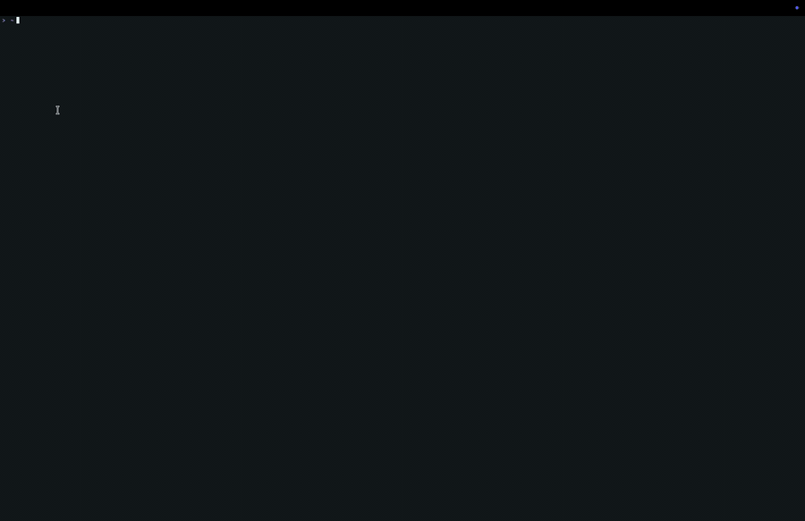

# DeepSeek Arkey

Standalone Rust CLI for using DeepSeek from the terminal, packaged as
`deepseek-arkey`.

For Mandarin-speaking users, a Simplified Chinese version is available here:
[README.zh-CN.md](./docs/development/README.zh-CN.md).



## What This Is

DeepSeek is an AI model provider. This project is an independent terminal client
for talking to DeepSeek models.

## Installation

With Homebrew:

```bash
brew install JulianAbeleda/tap/deepseek-arkey
export DEEPSEEK_API_KEY="your_deepseek_api_key"
deepseek-arkey login
deepseek-arkey
```

From source:

```bash
cargo build --release
cp target/release/deepseek-arkey ~/.local/bin/deepseek-arkey
cp target/release/deepseek ~/.local/bin/deepseek
export DEEPSEEK_API_KEY="your_deepseek_api_key"
deepseek-arkey login
```

For source installs, make sure `~/.local/bin` is on `PATH`. The `deepseek`
binary is kept as a compatibility alias.

For zsh persistence:

```bash
echo 'export DEEPSEEK_API_KEY="your_deepseek_api_key"' >> ~/.zsh_secrets
source ~/.zshrc
deepseek-arkey login
```

## Configuration

Internet search is opt-in by provider key:

- Search provider: `DEEPSEEK_SEARCH_PROVIDER=brave|tavily` (defaults to `brave`)
- Brave key: `BRAVE_SEARCH_API_KEY` (`BRAVE_API_KEY` is accepted as an alias)
- Tavily key: `TAVILY_API_KEY`
- Runtime switch: `/features toggle` persists the selected search provider
  (`brave` or `tavily`) without storing secrets.

Normal chat prefetches web context for URL and current-info prompts, but continues with a warning if web context is unavailable. Agent mode exposes two read-only web tools: `web_search` and `fetch_url`; explicit web tool calls return errors when the selected provider is missing its key or a fetch fails.

## Why This Exists

I started this project out of frustration with the current DeepSeek CLI ecosystem.

DeepSeek’s own CLI experience is web-first, and there was no dedicated terminal UI that felt comparable to tools like Codex, Kimi, or Claude Code. The unofficial DeepSeek TUIs I tried did not meet that bar. In my view, many of them leaned too heavily on dependency-driven
architecture instead of solving the hard terminal problems directly.

A common shortcut would be to build this in Rust with Ratatui. Ratatui is a good library, but using it also means giving up a level of control to its abstractions. For this project, control matters. I wanted to understand and own the terminal behavior myself.

The TUIs I respect tend to have a few premium qualities:

- scrollback that feels native
- a composed bottom dock
- inline CLI behavior
- predictable keyboard handling
- clean session flow

Those are the standards this project is aiming for.

## Philosophy

Another frustration I have with many AI-era repositories is maintenance discipline. Good projects can quickly become buried under commits, oversized scripts, and delayed refactors.

This repo is intentionally built around a few coding principles:

- centralization
- modularization
- orthogonality
- abstraction only when it removes real complexity

The goal is to keep the codebase lean, understandable, and maintainable. Features should earn their place. Complexity should be removed when possible, not normalized.

For more detail on the coding standards behind this project, see the [Coding Principles](./docs/development/coding-principles.md).

## Project Boundary

The purpose of this repo is to provide a focused, controllable DeepSeek terminal experience for people who want to review and direct their AI’s actions.

You are welcome to fork it. However, I do not plan to add features aimed at fully autonomous coding-agent frameworks such as OpenClaw or Hermes. My view is that AI should help people learn, reason, and stay involved in the work, not remove them from the process entirely.

If you want a DeepSeek TUI where you stay in the loop and review what your AI is doing, this project is for you.

## Development Docs

- [Coding Principles](./docs/development/coding-principles.md)
- [编码原则（简体中文）](./docs/development/coding-principles.zh-CN.md)
- [Commit Discipline](./docs/development/commit-discipline.md)
- [Phase 11 Routing Audit](./docs/development/phase11-routing-audit.md)
- [Phase 12 Dock Approval Scope](./docs/development/phase12-dock-approval-scope.md)

## License

MIT. See [LICENSE](LICENSE).
